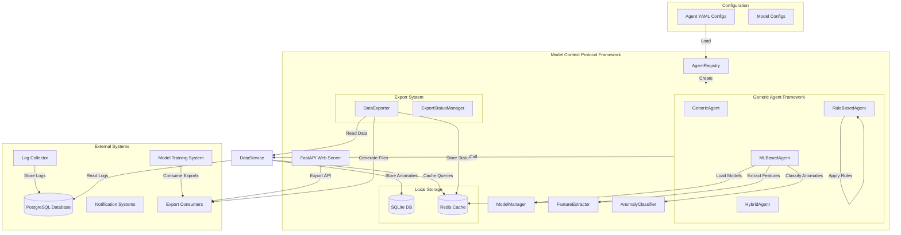

# Agent and Model Management in MCP

## Overview

This document provides a comprehensive description of how agents and models are managed and work together within the **Model Context Protocol (MCP)** framework. MCP is designed to enable domain-specific agents to interact with network logs, perform anomaly detection using pre-trained models, and export data for external analysis or training.

The MCP framework now uses a **Generic Agent Framework** that provides configuration-driven agent creation, supporting multiple agent types (ML-based, rule-based, and hybrid) through YAML configuration files.

## 1. Generic Agent Framework

### Framework Overview
The Generic Agent Framework replaces hardcoded agent implementations with a flexible, configuration-driven system that can create specialized agents dynamically. This approach provides:

- **Scalability**: Easy to add new agent types without code changes
- **Maintainability**: Single codebase for all agent logic
- **Flexibility**: Configuration-driven agent behavior
- **Model Assignment**: Dynamic model-agent associations

### Agent Types

#### A. ML-Based Agents (`agent_type: "ml_based"`)
- Use trained machine learning models for anomaly detection
- Require model files (`.pkl`, `.joblib`, etc.)
- Use FeatureExtractor and AnomalyClassifier components
- **Examples**: WiFiAgent, DNSAgent, SystemAgent, NetworkAgent

#### B. Rule-Based Agents (`agent_type: "rule_based"`)
- Use predefined rules and thresholds for detection
- No model files required (`model_path: null`)
- Simple pattern matching and filtering
- **Examples**: LogLevelAgent, ThresholdAgent

#### C. Hybrid Agents (`agent_type: "hybrid"`)
- Combine ML models with rule-based logic
- Fallback to rules when model unavailable
- Best of both approaches
- **Examples**: NetworkAgent (with fallback capabilities)

### Core Classes

#### GenericAgent
Base class that provides configuration-driven initialization and common functionality for all agent types:
- Configuration validation and loading
- Common lifecycle management
- Status tracking and Redis integration
- Process filtering and log retrieval

#### MLBasedAgent
Extends GenericAgent for machine learning-based detection:
- Model loading and management
- Feature extraction using FeatureExtractor
- Anomaly classification using AnomalyClassifier
- Fallback to default models when trained models unavailable

#### RuleBasedAgent
Extends GenericAgent for rule-based detection:
- Pattern matching and filtering
- Threshold-based detection
- Alert cooldown and escalation rules
- Regex pattern compilation for performance

#### HybridAgent
Combines ML-based and rule-based approaches:
- Primary detection method selection
- Fallback mechanisms
- Sub-agent management
- Combined analysis results

## 2. Agent-Specific Model Loading

### Configuration-Driven Model Assignment
Each agent is paired with a specific pre-trained model through configuration:

```yaml
# Example: wifi_agent.yaml
agent_id: "wifi_agent"
name: "WiFiAgent"
description: "WiFi anomaly detection using ML models"
agent_type: "ml_based"
model_path: "/app/models/wifi_anomaly_model.pkl"
```

### ModelManager Integration
The ModelManager is responsible for:
- Loading models from disk based on agent configuration
- Managing model registration and status
- Providing model information and metadata
- Handling model updates and versioning

### Fallback Mechanisms
- If no model file exists, ML-based agents use default threshold-based models
- Hybrid agents automatically fall back to rule-based detection
- Rule-based agents work without any model dependencies

## 3. Agent Workflow with Models

### Runtime Data Flow
1. **Configuration Loading**: AgentRegistry loads agent configurations from YAML files
2. **Agent Creation**: Agents are created dynamically based on configuration
3. **Model Loading**: ML-based agents load their models via ModelManager
4. **Log Retrieval**: Agents retrieve logs from PostgreSQL via DataService
5. **Feature Extraction**: ML-based agents use FeatureExtractor for structured features
6. **Inference**: ML-based agents apply models to extracted features
7. **Rule Processing**: Rule-based agents apply pattern matching and thresholds
8. **Anomaly Classification**: Results are classified as anomalies
9. **Storage**: Detected anomalies are stored in Redis/SQLite via DataService
10. **Status Updates**: Agent status is updated in Redis for real-time monitoring

### Example Workflow for WiFiAgent (ML-Based)
1. **Config** → `AgentRegistry.load_agent_configs()` → WiFiAgent config
2. **Agent** → `AgentRegistry.create_agent()` → MLBasedAgent instance
3. **Model** → `ModelManager.load_model()` → Model inference
4. **Logs** → `DataService.get_recent_logs()` → WiFiAgent
5. **Features** → `FeatureExtractor.extract_features()` → Extracted features
6. **Prediction** → `AnomalyClassifier.detect_anomalies()` → Anomaly classification
7. **Anomaly** → `DataService.store_anomaly()` → Redis/SQLite storage
8. **Status** → `ModelManager._update_model_status()` → Redis status updates

### Example Workflow for LogLevelAgent (Rule-Based)
1. **Config** → `AgentRegistry.load_agent_configs()` → LogLevelAgent config
2. **Agent** → `AgentRegistry.create_agent()` → RuleBasedAgent instance
3. **Logs** → `DataService.get_recent_logs()` → LogLevelAgent
4. **Pattern Matching** → `RuleBasedAgent._apply_patterns()` → Filtered logs
5. **Threshold Check** → `RuleBasedAgent._check_thresholds()` → Anomaly detection
6. **Anomaly** → `DataService.store_anomaly()` → Redis/SQLite storage
7. **Status** → `RuleBasedAgent._update_status()` → Redis status updates

## 4. Architecture

### Key Components
- **AgentRegistry**: Manages agent configurations and creation
- **GenericAgent**: Base class for all agent types
- **MLBasedAgent**: ML-based anomaly detection
- **RuleBasedAgent**: Rule-based anomaly detection
- **HybridAgent**: Combined ML and rule-based detection
- **ModelManager**: Model loading and management
- **DataService**: Centralized database access
- **FeatureExtractor**: Feature extraction for ML models
- **AnomalyClassifier**: Anomaly classification

### System Context
The MCP interfaces with:
- **PostgreSQL Database**: Stores logs collected by external log collector (read-only access)
- **SQLite Database**: Local storage for detected anomalies and export status
- **Redis**: Caching, status management, temporary storage
- **External Model Training System**: Consumes exported logs/anomalies for training; deploys new models to MCP

### Runtime Data Flow


## 5. Configuration Management

### Agent Configuration Files
Agent configurations are stored in YAML files under `backend/app/config/agents/`:

```
backend/app/config/agents/
├── wifi_agent.yaml
├── dns_agent.yaml
├── system_agent.yaml
├── log_level_agent.yaml
├── network_agent.yaml
└── threshold_agent.yaml
```

### Configuration Schema

#### Required Fields
```yaml
agent_id: "unique_agent_identifier"    # Required: Unique identifier
name: "Agent Display Name"             # Required: Human-readable name
description: "Agent description"       # Required: Detailed description
agent_type: "ml_based"                 # Required: ml_based, rule_based, or hybrid
```

#### Optional Fields
```yaml
process_filters: ["process1", "process2"]  # List of processes to monitor
model_path: "/path/to/model.pkl"           # Path to model file (null for rule-based)
capabilities: ["Capability 1", "Capability 2"]  # List of detection capabilities
```

#### Analysis Rules
```yaml
analysis_rules:
  lookback_minutes: 5
  analysis_interval: 60
  severity_mapping:
    anomaly_type_1: 4
    anomaly_type_2: 5
  # ML-based specific
  feature_extraction:
    feature_1: true
    feature_2: true
  thresholds:
    threshold_1: 100
    threshold_2: 50
  # Rule-based specific
  target_levels: ["error", "critical"]
  exclude_patterns: [".*test.*"]
  include_patterns: [".*production.*"]
  alert_cooldown: 300
  # Hybrid specific
  fallback_rules:
    enable_fallback: true
    rule_based_detection: true
```

### Configuration Examples

#### ML-Based Agent (WiFiAgent)
```yaml
agent_id: "wifi_agent"
name: "WiFiAgent"
description: "WiFi anomaly detection using ML models"
agent_type: "ml_based"
process_filters: ["hostapd", "wpa_supplicant"]
model_path: "/app/models/wifi_anomaly_model.pkl"
capabilities: [
  "Authentication failure detection",
  "Deauthentication flood detection",
  "Beacon frame flood detection"
]
analysis_rules:
  lookback_minutes: 5
  analysis_interval: 60
  feature_extraction:
    auth_failures: true
    deauth_count: true
    beacon_count: true
  severity_mapping:
    auth_failure: 4
    deauth_flood: 5
    beacon_flood: 3
  thresholds:
    auth_failure_threshold: 5
    deauth_flood_threshold: 10
    beacon_flood_threshold: 100
```

#### Rule-Based Agent (LogLevelAgent)
```yaml
agent_id: "log_level_agent"
name: "LogLevelAgent"
description: "Rule-based log level monitoring"
agent_type: "rule_based"
process_filters: []  # All processes
model_path: null  # No model required
capabilities: [
  "Error log level detection",
  "Critical log level detection",
  "Warning level monitoring"
]
analysis_rules:
  lookback_minutes: 5
  analysis_interval: 60
  target_levels: ["error", "critical", "warning"]
  severity_mapping:
    error: 4
    critical: 5
    warning: 3
  confidence: 1.0
  exclude_patterns: [".*test.*", ".*debug.*"]
  include_patterns: [".*auth.*", ".*network.*", ".*system.*"]
  alert_cooldown: 300
  escalation_rules:
    error_critical: 10
    critical_critical: 5
```

#### Hybrid Agent (NetworkAgent)
```yaml
agent_id: "network_agent"
name: "NetworkAgent"
description: "Network traffic anomaly detection"
agent_type: "hybrid"
process_filters: ["iptables", "ufw", "firewalld", "netfilter"]
model_path: "/app/models/network_anomaly_model.pkl"
capabilities: [
  "Network traffic pattern analysis",
  "Firewall rule violation detection",
  "Port scanning detection"
]
analysis_rules:
  lookback_minutes: 20
  analysis_interval: 180
  feature_extraction:
    packet_count: true
    connection_count: true
    port_scanning: true
    traffic_patterns: true
  severity_mapping:
    traffic_anomaly: 4
    firewall_violation: 5
    port_scan: 4
  thresholds:
    packet_threshold: 10000
    connection_threshold: 1000
    port_scan_threshold: 100
  fallback_rules:
    enable_fallback: true
    rule_based_detection: true
```

## 6. Model Deployment and Updates

### External Model Training
Model training is performed externally by the `Trainer` system. MCP does not handle training but relies on pre-trained models deployed to the model directory.

### Dynamic Model Loading
- Agents check for model files during startup based on configuration
- If no model file exists, ML-based agents use default threshold-based models
- Model files are loaded using pickle or joblib
- Model updates require restarting the agent

### Model Registration
- Agents register themselves with the `ModelManager` during startup
- Registration includes agent capabilities, description, and status
- Status is maintained in Redis for real-time monitoring

## 7. Data Storage and Management

### PostgreSQL (External)
- **Purpose**: Read-only access to logs collected by external system
- **Schema**: `log_entries` table with fields like `id`, `device_id`, `timestamp`, `log_level`, `process_name`, `message`
- **Access**: Via `DataService.get_logs_by_program()` and `DataService.get_recent_logs()`

### SQLite (Local)
- **Purpose**: Persistent storage for anomalies and export status
- **Tables**: `mcp_anomalies`, `export_status`
- **Access**: Via `DataService.store_anomaly()` and `DataService.get_anomalies()`

### Redis (Cache & Status)
- **Purpose**: Caching, status management, temporary storage
- **Keys**: `mcp:model:{model_id}:status`, `export:metadata:{export_id}`
- **Access**: Via `ModelManager` and `ExportStatusManager`

## 8. Export System

### Components
- **DataExporter**: Handles data export from PostgreSQL to various formats (JSON, CSV, ZIP)
- **ExportStatusManager**: Manages export status and metadata in Redis
- **ExportCleanupService**: Handles cleanup of old export files

### Export Workflow
1. Export request via API
2. Background task creation with progress tracking
3. Data retrieval from PostgreSQL via DataService
4. Data processing and format conversion
5. File generation and storage
6. Status updates in Redis

## 9. Extensibility

### Adding New Agents
New agents can be added by:
1. Creating a YAML configuration file in `backend/app/config/agents/`
2. Specifying the agent type (`ml_based`, `rule_based`, or `hybrid`)
3. Configuring analysis rules and parameters
4. Adding model files to the model directory (for ML-based agents)
5. The AgentRegistry will automatically load and create the agent

### Adding New Models
New models can be deployed by:
1. Placing model files in the model directory
2. Updating agent configuration to point to new model files
3. Restarting the agent to load the new model

### Custom Agent Types
For specialized requirements, new agent types can be created by:
1. Extending the `GenericAgent` class
2. Implementing the required abstract methods
3. Adding the new agent type to the `AgentRegistry.create_agent()` method
4. Creating appropriate configuration schemas

## 10. Configuration

### Agent Configuration
```yaml
# Example agent configuration (wifi_agent.yaml)
agent_id: "wifi_agent"
name: "WiFiAgent"
description: "WiFi anomaly detection using ML models"
agent_type: "ml_based"
process_filters: ["hostapd", "wpa_supplicant"]
model_path: "/app/models/wifi_anomaly_model.pkl"
capabilities: [
  "Authentication failure detection",
  "Deauthentication flood detection",
  "Beacon frame flood detection"
]
analysis_rules:
  lookback_minutes: 5
  analysis_interval: 60
  feature_extraction:
    auth_failures: true
    deauth_count: true
    beacon_count: true
  severity_mapping:
    auth_failure: 4
    deauth_flood: 5
    beacon_flood: 3
  thresholds:
    auth_failure_threshold: 5
    deauth_flood_threshold: 10
    beacon_flood_threshold: 100
```

### Model Configuration
```yaml
# model_config.yaml
version: '2.0.0'
model:
  type: isolation_forest
  n_estimators: 100
  contamination: 0.1
storage:
  directory: models
  version_format: '%Y%m%d_%H%M%S'
```

### Database Configuration
```yaml
# data_source_config.yaml
host: 192.168.10.14
port: 5432
database: netmonitor_db
user: netmonitor_user
password: netmonitor_password
```

## 11. Monitoring and Status

### Agent Status
- **Active**: Agent is running and processing logs
- **Analyzing**: Agent is currently processing a batch of logs
- **Inactive**: Agent is stopped
- **Error**: Agent encountered an error

### Status Storage
- Agent status is stored in Redis with keys like `mcp:model:{model_id}:status`
- Status includes `is_running`, `last_run`, `capabilities`, `description`, `agent_type`
- Status is updated in real-time during agent operation

### Health Checks
- DataService provides health checks for PostgreSQL, SQLite, and Redis connections
- ModelManager tracks model loading and registration status
- Export system tracks export progress and completion status

## 12. Migration from Legacy System

### Legacy Agent Support
The Generic Agent Framework maintains backward compatibility:
- Legacy agent files are preserved in `backend/app/mcp_service/agents/legacy/`
- Existing functionality is preserved through configuration-driven equivalents
- Gradual migration path from hardcoded to configuration-driven agents

### Migration Benefits
- **Reduced Code Duplication**: Single codebase for all agent types
- **Easier Maintenance**: Configuration changes vs. code changes
- **Better Testing**: Isolated configuration testing
- **Enhanced Flexibility**: Dynamic agent creation and modification

## 13. Conclusion

The MCP framework with the Generic Agent Framework provides a robust, modular system for managing agents and models. By standardizing agent interaction with logs and models through configuration-driven approaches, MCP enables efficient anomaly detection and data export while maintaining separation of concerns between log collection, anomaly detection, and model training.

The new framework significantly improves scalability, maintainability, and flexibility while preserving all existing functionality and providing a clear migration path from the legacy system.

---
**Note**:  
- **Model training, validation, and training UI are not part of MCP.**  
- **Log collection is handled by an external system; MCP only reads from its database.**
- **Agents use fallback threshold-based models when no trained model files are available.**
- **The Generic Agent Framework supports dynamic agent creation through YAML configuration files.**
