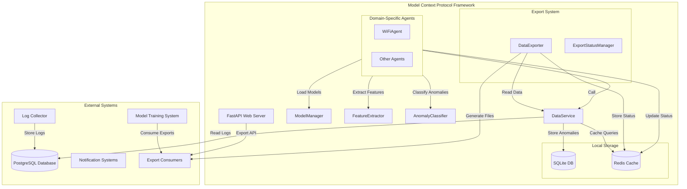

# Agent and Model Management in MCP

## Overview

This document provides a comprehensive description of how agents and models are managed and work together within the **Model Context Protocol (MCP)** framework. MCP is designed to enable domain-specific agents to interact with network logs, perform anomaly detection using pre-trained models, and export data for external analysis or training.

## 1. Agent and Model Pairing

### Agent-Specific Model Loading
Each agent is paired with a specific pre-trained model that is used for inference. This pairing is established through:
- **Agent Configuration**: Each agent is initialized with a configuration object specifying the path to its model and other domain-specific parameters.
- **ModelManager**: Responsible for loading the correct model from disk based on the agent's configuration.

### Configuration Example
```yaml
# Example agent configuration (agent_config.yaml)
processing_interval: 60  # seconds between processing cycles
batch_size: 1000        # number of logs to process in each cycle
lookback_window: 30     # minutes of historical data to consider
model_path: "models/wifi_anomaly_detector.joblib"
```

### Model Storage Structure
Models are stored in a structured directory format. The current implementation uses:
- **Model Directory**: `models/` (configurable via `config.model_dir`)
- **Model Files**: `.pkl` or `.joblib` files (e.g., `wifi_anomaly_model.pkl`)
- **Fallback**: If no model file exists, agents use default threshold-based models

Agents use the `ModelManager` to load their respective models dynamically during runtime.

## 2. Agent Workflow with Models

### Runtime Data Flow
1. **Log Retrieval**: Agents retrieve logs from the PostgreSQL database via the `DataService`.
2. **Feature Extraction**: Logs are processed by the agent-specific feature extractor (e.g., `FeatureExtractor`) to generate structured features required for inference.
3. **Model Loading**: The agent uses the `ModelManager` to load its pre-trained model from the configured model directory.
4. **Inference**: The agent applies the model to the extracted features to generate predictions.
5. **Anomaly Classification**: Predictions are classified as anomalies using the agent-specific anomaly classifier (e.g., `AnomalyClassifier`).
6. **Anomaly Storage**: Detected anomalies are stored in Redis (temporary) and/or SQLite (persistent) via the `DataService`.
7. **Status Updates**: Agent status is updated in Redis for real-time monitoring.

### Example Workflow for WiFiAgent
1. **Logs** → `DataService.get_recent_logs()` → WiFiAgent
2. **Logs** → `FeatureExtractor.extract_features()` → Extracted features
3. **Features** → `ModelManager.load_model()` → Model inference
4. **Prediction** → `AnomalyClassifier.detect_anomalies()` → Anomaly classification
5. **Anomaly** → `DataService.store_anomaly()` → Redis/SQLite storage
6. **Status** → `ModelManager._update_model_status()` → Redis status updates

## 3. Architecture

### Key Components
- **Agents**: Modular, pluggable classes for domain-specific anomaly detection. Each agent implements the `BaseAgent` interface to process logs and perform inference.
- **ModelManager**: Singleton class that loads pre-trained models from disk for inference and manages agent registration.
- **DataService**: Centralized access to PostgreSQL (logs), SQLite (anomalies), and Redis (cache and status).
- **FeatureExtractor**: Extracts features from log data for model inference.
- **AnomalyClassifier**: Classifies model predictions as anomalies.

### System Context
The MCP interfaces with:
- **PostgreSQL Database**: Stores logs collected by an external log collector (read-only access).
- **SQLite Database**: Local storage for detected anomalies and export status.
- **Redis**: Caching, status management, temporary storage.
- **External Model Training System**: Consumes exported logs/anomalies for training; deploys new models to MCP.

### Runtime Data Flow


## 4. Model Deployment and Updates

### External Model Training
Model training is performed externally by the `Trainer` system. MCP does not handle training but relies on pre-trained models deployed to the model directory.

### Dynamic Model Loading
- Agents check for model files during startup
- If no model file exists, agents use default threshold-based models
- Model files are loaded using pickle or joblib
- Model updates require restarting the agent

### Model Registration
- Agents register themselves with the `ModelManager` during startup
- Registration includes agent capabilities, description, and status
- Status is maintained in Redis for real-time monitoring

## 5. Data Storage and Management

### PostgreSQL (External)
- **Purpose**: Read-only access to logs collected by external system
- **Schema**: `log_entries` table with fields like `id`, `device_id`, `timestamp`, `log_level`, `process_name`, `message`
- **Access**: Via `DataService.get_logs_by_program()` and `DataService.get_recent_logs()`

### SQLite (Local)
- **Purpose**: Persistent storage for anomalies and export status
- **Tables**: `mcp_anomalies`, `export_status`
- **Access**: Via `DataService.store_anomaly()` and `DataService.get_anomalies()`

### Redis (Cache & Status)
- **Purpose**: Caching, status management, temporary storage
- **Keys**: `mcp:model:{model_id}:status`, `export:metadata:{export_id}`
- **Access**: Via `ModelManager` and `ExportStatusManager`

## 6. Export System

### Components
- **DataExporter**: Handles data export from PostgreSQL to various formats (JSON, CSV, ZIP)
- **ExportStatusManager**: Manages export status and metadata in Redis
- **ExportCleanupService**: Handles cleanup of old export files

### Export Workflow
1. Export request via API
2. Background task creation with progress tracking
3. Data retrieval from PostgreSQL via DataService
4. Data processing and format conversion
5. File generation and storage
6. Status updates in Redis

## 7. Extensibility

### Adding New Agents
New agents can be added by:
1. Implementing the `BaseAgent` abstract class
2. Creating domain-specific feature extractors and anomaly classifiers
3. Adding model files to the model directory
4. Registering the agent with the `ModelManager`

### Adding New Models
New models can be deployed by:
1. Placing model files in the model directory
2. Updating agent configuration to point to new model files
3. Restarting the agent to load the new model

## 8. Configuration

### Agent Configuration
```yaml
# agent_config.yaml
processing_interval: 60
batch_size: 1000
lookback_window: 30
model_path: "models/wifi_anomaly_detector.joblib"
```

### Model Configuration
```yaml
# model_config.yaml
version: '2.0.0'
model:
  type: isolation_forest
  n_estimators: 100
  contamination: 0.1
storage:
  directory: models
  version_format: '%Y%m%d_%H%M%S'
```

### Database Configuration
```yaml
# data_source_config.yaml
host: 192.168.10.14
port: 5432
database: netmonitor_db
user: netmonitor_user
password: netmonitor_password
```

## 9. Monitoring and Status

### Agent Status
- **Active**: Agent is running and processing logs
- **Analyzing**: Agent is currently processing a batch of logs
- **Inactive**: Agent is stopped
- **Error**: Agent encountered an error

### Status Storage
- Agent status is stored in Redis with keys like `mcp:model:{model_id}:status`
- Status includes `is_running`, `last_run`, `capabilities`, `description`
- Status is updated in real-time during agent operation

### Health Checks
- DataService provides health checks for PostgreSQL, SQLite, and Redis connections
- ModelManager tracks model loading and registration status
- Export system tracks export progress and completion status

## 10. Conclusion

The MCP framework provides a robust, modular system for managing agents and models. By standardizing agent interaction with logs and models, MCP enables efficient anomaly detection and data export while maintaining separation of concerns between log collection, anomaly detection, and model training.

---
**Note**:  
- **Model training, validation, and training UI are not part of MCP.**  
- **Log collection is handled by an external system; MCP only reads from its database.**
- **Agents use fallback threshold-based models when no trained model files are available.**
