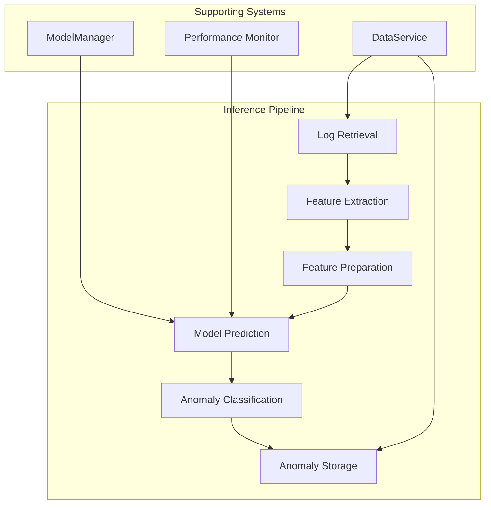

# Inference System - Runtime Operation Guide

## Overview

This document provides a comprehensive guide to how the MCP service performs real-time inference for anomaly detection. It covers the complete inference workflow from log ingestion through feature extraction, model prediction, and anomaly classification.

## Inference Architecture

### Core Components



## 1. Log Retrieval and Preprocessing

### Agent Analysis Cycle
Each agent runs periodic analysis cycles (typically every 60 seconds):

```python
# Example from WiFiAgent.run_analysis_cycle()
logs = await self.data_service.get_recent_logs(
    programs=self.programs,  # e.g., ["hostapd", "wpa_supplicant"]
    minutes=5                # Lookback window
)
```

### Log Filtering
- **Process-based filtering**: Only logs from specified processes
- **Time-based filtering**: Recent logs within lookback window
- **Level-based filtering**: Optional filtering by log levels

## 2. Feature Extraction Process

### Feature Extraction Workflow

```python
# From FeatureExtractor.extract_wifi_features()
features = {
    'auth_failures': 0,        # Authentication failure count
    'deauth_count': 0,         # Deauthentication frame count
    'beacon_count': 0,         # Beacon frame count
    'unique_mac_count': 0,     # Unique MAC addresses
    'unique_ssid_count': 0,    # Unique SSIDs
    'reason_codes': {},        # WiFi reason code distribution
    'status_codes': {},        # WiFi status code distribution
    'program_counts': {}       # Program-specific counts
}
```

### Feature Extraction Methods

#### WiFi Features
- **Pattern Matching**: Regex-based extraction of WiFi events
- **MAC Address Detection**: Extract and count unique MAC addresses
- **SSID Extraction**: Parse SSID information from logs
- **Reason/Status Codes**: Extract and categorize WiFi codes

#### Generic Features
- **Temporal Features**: Time-based patterns and distributions
- **Frequency Features**: Event frequency and rate calculations
- **Statistical Features**: Mean, variance, and distribution metrics

## 3. Feature Preparation for Model Input

### Feature Vector Construction

```python
# From AnomalyClassifier._prepare_features()
feature_vector = [
    features['auth_failures'],
    features['deauth_count'], 
    features['beacon_count'],
    features['unique_mac_count'],
    features.get('unique_ssid_count', 0)
]

# Add reason codes (1-17)
for code in range(1, 18):
    feature_vector.append(
        features.get('reason_codes', {}).get(str(code), 0)
    )

# Add status codes (1-17)  
for code in range(1, 18):
    feature_vector.append(
        features.get('status_codes', {}).get(str(code), 0)
    )

# Convert to numpy array
X = np.array(feature_vector).reshape(1, -1)
```

### Feature Scaling
```python
# From ModelManager.predict()
if self.current_scaler is not None:
    features = self.current_scaler.transform(features)
```

## 4. Model Inference Process

### Prediction Methods

#### Standard Prediction
```python
# From ModelManager.predict()
predictions = self.current_model.predict(features)
# Returns: -1 for anomalies, 1 for normal
```

#### Probability Prediction
```python
# From ModelManager.predict_proba()
if hasattr(self.current_model, 'predict_proba'):
    probabilities = self.current_model.predict_proba(features)
elif hasattr(self.current_model, 'score_samples'):
    # For anomaly detection models
    scores = self.current_model.score_samples(features)
    probabilities = np.exp(scores)
```

### Model Types Supported

1. **Isolation Forest**: Returns -1 (anomaly) or 1 (normal)
2. **One-Class SVM**: Returns -1 (anomaly) or 1 (normal)
3. **Binary Classifiers**: Returns 0 (normal) or 1 (anomaly)
4. **Custom Models**: Must implement predict() method

## 5. Anomaly Classification

### Classification Process

```python
# From AnomalyClassifier.detect_anomalies()
def detect_anomalies(self, features: Dict[str, Any]) -> List[Dict[str, Any]]:
    anomalies = []
    
    # Rule-based detection
    rule_based_anomalies = self._detect_rule_based_anomalies(features)
    anomalies.extend(rule_based_anomalies)
    
    # ML model-based detection
    if self.model:
        ml_anomalies = self._detect_ml_anomalies(features)
        anomalies.extend(ml_anomalies)
    
    return anomalies
```

### Rule-Based Detection

```python
# Threshold-based anomaly detection
if features['auth_failures'] > self.thresholds['auth_failures']:
    anomalies.append({
        'type': 'auth_failure',
        'severity': 4,
        'confidence': 0.95,
        'description': f"High auth failures: {features['auth_failures']}",
        'features': features
    })
```

### ML-Based Detection

```python
# ML model prediction with confidence threshold
predictions = self.model.predict_proba(X)
for i, pred in enumerate(predictions):
    if pred[1] > self.threshold:  # Confidence threshold (0.95)
        anomaly = self._create_anomaly(features, pred[1], i)
        anomalies.append(anomaly)
```

## 6. Performance Monitoring

### Inference Metrics Tracking

```python
# From ModelPerformanceMonitor.record_inference_metrics()
await self.record_inference_metrics(
    model_version=model_version,
    inference_time=inference_time,
    anomaly_score=anomaly_score,
    is_anomaly=is_anomaly
)
```

### Performance Metrics

- **Inference Time**: Time taken for prediction
- **Anomaly Rate**: Percentage of predictions classified as anomalies
- **Throughput**: Predictions per second
- **Memory Usage**: Memory consumption during inference
- **Error Rate**: Failed inference attempts

### Drift Detection

```python
# From ModelPerformanceMonitor.check_model_drift()
drift_indicators = {
    'anomaly_rate_change': self._calculate_anomaly_rate_change(metrics),
    'score_distribution_change': self._calculate_score_distribution_change(metrics),
    'inference_time_change': self._calculate_inference_time_change(metrics)
}
```

## 7. Real-Time Inference Workflow

### Complete Inference Cycle

```python
async def run_inference_cycle(self):
    """Complete inference cycle for an agent."""
    
    # 1. Retrieve logs
    logs = await self.data_service.get_recent_logs(
        programs=self.programs,
        minutes=self.lookback_minutes
    )
    
    if not logs:
        return
    
    # 2. Extract features
    features = await self.feature_extractor.extract_features(logs)
    
    # 3. Prepare features for model
    X = self._prepare_features(features)
    
    # 4. Make prediction
    start_time = time.time()
    predictions = await self.model_manager.predict(X)
    inference_time = time.time() - start_time
    
    # 5. Get probabilities
    probabilities = await self.model_manager.predict_proba(X)
    
    # 6. Classify anomalies
    anomalies = self.classifier.detect_anomalies(features)
    
    # 7. Store anomalies
    for anomaly in anomalies:
        await self.store_anomaly(
            anomaly_type=anomaly['type'],
            severity=anomaly['severity'],
            confidence=anomaly['confidence'],
            description=anomaly['description'],
            features=anomaly['features']
        )
    
    # 8. Record performance metrics
    await self.performance_monitor.record_inference_metrics(
        model_version=self.model_manager.current_model_version,
        inference_time=inference_time,
        anomaly_score=np.mean(probabilities),
        is_anomaly=len(anomalies) > 0
    )
```

## 8. Error Handling and Fallbacks

### Inference Error Handling

```python
try:
    predictions = await self.model_manager.predict(features)
except RuntimeError as e:
    # Model not loaded
    self.logger.error(f"Model not loaded: {e}")
    return []
except Exception as e:
    # Other inference errors
    self.logger.error(f"Inference error: {e}")
    # Fall back to rule-based detection only
    return self._detect_rule_based_anomalies(features)
```

### Fallback Mechanisms

1. **Rule-Based Fallback**: If ML model fails, use rule-based detection
2. **Default Thresholds**: Use conservative thresholds when model unavailable
3. **Error Logging**: Comprehensive error logging for debugging
4. **Graceful Degradation**: Continue operation with reduced functionality

## 9. Resource Management

### Memory Management

- **Feature Caching**: Cache extracted features to reduce computation
- **Model Loading**: Load models on-demand and unload unused models
- **Garbage Collection**: Regular cleanup of temporary data structures

### CPU Optimization

- **Batch Processing**: Process multiple logs in batches when possible
- **Async Operations**: Use async/await for I/O operations
- **Resource Monitoring**: Monitor CPU usage and throttle if necessary

## 10. Configuration and Tuning

### Inference Configuration

```yaml
# model_config.yaml
model:
  type: isolation_forest
  threshold: 0.95  # Confidence threshold
  batch_size: 100  # Batch processing size

inference:
  max_inference_time: 1.0  # Maximum inference time (seconds)
  memory_limit: 512  # Memory limit (MB)
  enable_fallback: true  # Enable rule-based fallback
```

### Performance Tuning

1. **Threshold Adjustment**: Tune confidence thresholds for accuracy vs. sensitivity
2. **Batch Size**: Optimize batch size for throughput vs. latency
3. **Feature Selection**: Select most relevant features for performance
4. **Model Optimization**: Use optimized model formats (ONNX, TensorRT)

## 11. Monitoring and Observability

### Inference Metrics

```python
# Key metrics to monitor
metrics = {
    'inference_latency_p50': 0.1,    # 50th percentile latency
    'inference_latency_p95': 0.3,    # 95th percentile latency
    'inference_throughput': 100,     # Predictions per second
    'anomaly_detection_rate': 0.05,  # 5% anomaly rate
    'model_accuracy': 0.92,          # Model accuracy
    'feature_extraction_time': 0.05, # Feature extraction time
    'memory_usage_mb': 128,          # Memory usage
    'cpu_usage_percent': 15          # CPU usage
}
```

### Alerting

- **High Latency**: Alert when inference time exceeds thresholds
- **High Error Rate**: Alert when inference errors exceed acceptable levels
- **Model Drift**: Alert when model performance degrades significantly
- **Resource Exhaustion**: Alert when memory or CPU usage is high

## 12. Best Practices

### Performance Best Practices

1. **Feature Engineering**: Optimize feature extraction for speed and relevance
2. **Model Selection**: Choose models appropriate for real-time inference
3. **Caching**: Cache frequently used data and computations
4. **Monitoring**: Continuously monitor performance and adjust as needed

### Reliability Best Practices

1. **Error Handling**: Implement comprehensive error handling
2. **Fallbacks**: Provide fallback mechanisms for critical failures
3. **Testing**: Test inference pipeline with various input scenarios
4. **Documentation**: Document inference behavior and limitations

### Security Best Practices

1. **Input Validation**: Validate all input data before processing
2. **Model Security**: Ensure models are from trusted sources
3. **Access Control**: Implement appropriate access controls
4. **Audit Logging**: Log all inference operations for audit purposes

## Conclusion

The inference system provides a robust, real-time anomaly detection capability with comprehensive monitoring, error handling, and performance optimization. Understanding the complete inference workflow is essential for effective system operation, troubleshooting, and optimization.

The system is designed to be reliable, performant, and maintainable, with clear separation of concerns and comprehensive monitoring capabilities. Regular monitoring and tuning of the inference pipeline ensures optimal performance and reliability in production environments.

---

*This document provides the technical details needed to understand and operate the inference system effectively. For operational procedures, see the ModelManagement.md and Agent_and_Model.md documents.* 