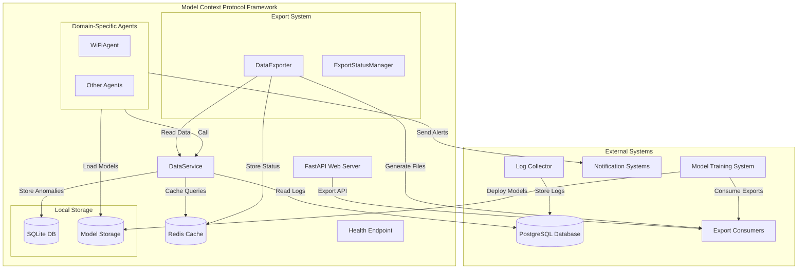

# Model Context Protocol (MCP) – Architecture

## 1. Introduction

This document describes the architecture of the **Model Context Protocol (MCP)**, a standalone framework designed to enable domain-specific agents to interact with OpenWRT network logs for anomaly detection and data export. MCP is built for resource-constrained devices (e.g., Raspberry Pi 5) and is intended to be modular, extensible, and robust. **Model training is not part of this system**; instead, MCP focuses on providing a protocol and infrastructure for log extraction, agent-based anomaly detection using pre-trained models, and exporting data for external model training.

### Purpose

The **Model Context Protocol (MCP)** is a framework that standardizes how domain-specific agents interact with network logs and models. Its main goals are:

- **Agent Interoperability:** Provide a protocol for agents to access, process, and annotate logs in a consistent way, regardless of the log source or domain.
- **Separation of Concerns:** Decouple log collection, anomaly detection, and model training, allowing each to evolve independently.
- **Extensibility:** Enable easy integration of new agents for different domains (e.g., Wi-Fi, firewall, DNS) without modifying the core system.
- **Export for Training:** Facilitate the extraction and transformation of logs and anomalies into formats suitable for external AI model training systems.

### Objectives

- **Modularity:** Plug-and-play agent architecture for domain-specific anomaly detection.
- **Efficiency:** Optimized for low-resource environments (direct method calls, connection pooling, caching).
- **Decoupling:** Minimal dependency on the log collector’s schema; model training and inference are separated.
- **Local Storage:** Anomalies are stored in a local SQLite database.
- **Remote Operation:** Secure, reliable access to a remote PostgreSQL log database.
- **Robustness:** Health checks, graceful shutdowns, and error handling.
- **Data Export:** Export logs and anomalies for external model training and analysis.

### Key Features

- **Model Context Protocol:** Defines interfaces and data contracts for agent interaction with logs and models.
- Centralized `DataService` for database and cache access.
- Pluggable agent architecture based on `BaseAgent`.
- Local SQLite storage for anomalies.
- Disk-based model storage for inference (models are trained and updated externally).
- Secure PostgreSQL connectivity with Redis caching and retry logic.
- Health check endpoint for Docker monitoring.
- **Data Export System:** Export logs/anomalies for external training, with background processing and status tracking.

## 2. System Context

The MCP is a Dockerized application that interfaces with:

- **PostgreSQL Database:** Stores logs collected by an external log collector (not part of MCP).
- **SQLite Database:** Local storage for detected anomalies.
- **Notification Systems:** Email/Slack for anomaly alerts.
- **External Model Training System:** Consumes exported logs/anomalies for training; deploys new models to MCP.
- **Export Consumers:** Systems that use exported data for analysis, compliance, or training.

**Model training, validation, and training UI are not part of MCP.** These are handled by a separate, dedicated system.

### Diagram

## 3. Architecture

The MCP runs as a single process within a Docker container, comprising:

- **Model Context Protocol:** Defines the interfaces and contracts for agent interaction with logs and models.
- **DataService:** Centralized access to PostgreSQL (logs), SQLite (anomalies), and Redis (cache).
- **Agents:** Modular, pluggable classes for domain-specific anomaly detection. Each agent implements the MCP interfaces to process logs and perform inference.
- **ModelManager:** Loads pre-trained models from disk for inference.
- **Export System:** Exports logs/anomalies for external training/analysis.
- **FastAPI Web Server:** REST API for management and export.
- **Health Endpoint:** Lightweight health check for monitoring.

**Model training is performed externally.** MCP only loads models for inference.

## 4. Data Flow

### Runtime Data Flow

1. **Log Extraction:** MCP reads logs from the external log collector’s PostgreSQL database.
2. **Agent Processing:** Agents, following the MCP protocol, process logs, extract features, and use pre-trained models for inference.
3. **Anomaly Storage:** Detected anomalies are stored in local SQLite.
4. **Notification:** Alerts are sent via email/Slack if anomalies are detected.
5. **Export:** Logs/anomalies can be exported for external model training or analysis.

### Export Data Flow

1. **Client requests export** via API.
2. **Export job runs in background**, reading logs/anomalies, transforming data, and writing export files.
3. **Status is tracked** in Redis.
4. **Client downloads export** for use in external model training.

## 5. Model Context Protocol Details

- **Agent Interface:** All agents must implement a standard interface for log retrieval, feature extraction, inference, and anomaly reporting.
- **Data Contracts:** Defines the structure for logs, features, anomalies, and export formats.
- **Extensibility:** New agents can be added by implementing the protocol, enabling support for new domains or log types without changing the core system.
- **Model Loading:** Agents use the protocol to load and apply pre-trained models for inference.

## 6. Database Schema

- **PostgreSQL:** Read-only access to `log_entries` (populated by external log collector).
- **SQLite:** Local `mcp_anomalies` table for detected anomalies.

## 7. Status Variables

- **Redis:** Tracks health/status of MCP components and export jobs.

## 8. Configuration

- **Environment variables** for database, Redis, and export settings.

## 9. Deployment

- **Docker Compose** for MCP and Redis.
- **Volumes** for models, anomaly data, and exports.

## 10. Resource Optimization

- Direct method calls, connection pooling, Redis caching, batch export processing.

## 11. Security

- Read-only DB access, secure model file transfer, environment variable credentials.

## 12. Extensibility

- Add new agents by implementing the MCP agent interface.
- Extend export formats and filters as needed.

## 13. Implementation Steps

1. Configure PostgreSQL access.
2. Initialize SQLite.
3. Deploy Redis.
4. Implement/extend agents and components using the MCP protocol.
5. Deploy pre-trained models (from external training system).
6. Deploy MCP service.
7. Test log retrieval, anomaly detection, health, and export.

## 14. Testing

- **Unit tests** for data access, agent logic, and protocol compliance.
- **Integration tests** for end-to-end anomaly detection and export.

## 15. Conclusion

The Model Context Protocol (MCP) provides a robust, modular framework for agent-based anomaly detection on network logs, with clear separation from model training. By standardizing agent interaction with logs and models, MCP enables efficient log extraction, anomaly detection using externally trained models, and export of data for further training or analysis. The architecture supports future extensibility and is optimized for resource-constrained environments.

---

**Note:**  
- **Model training, validation, and training UI are not part of MCP.**  
- **Log collection is handled by an external system; MCP only reads from its database.**  
- **MCP’s main responsibilities:** providing a protocol for agent interaction, log extraction, anomaly detection (inference), anomaly storage,