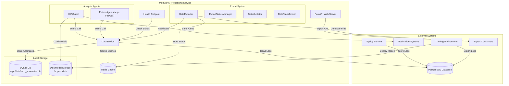
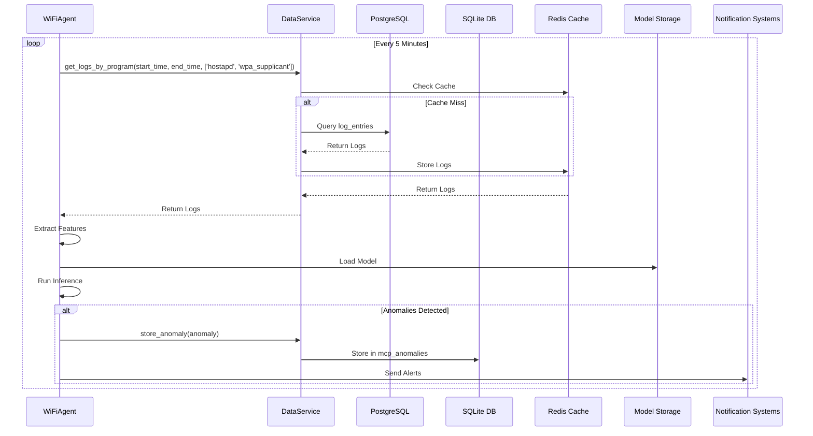
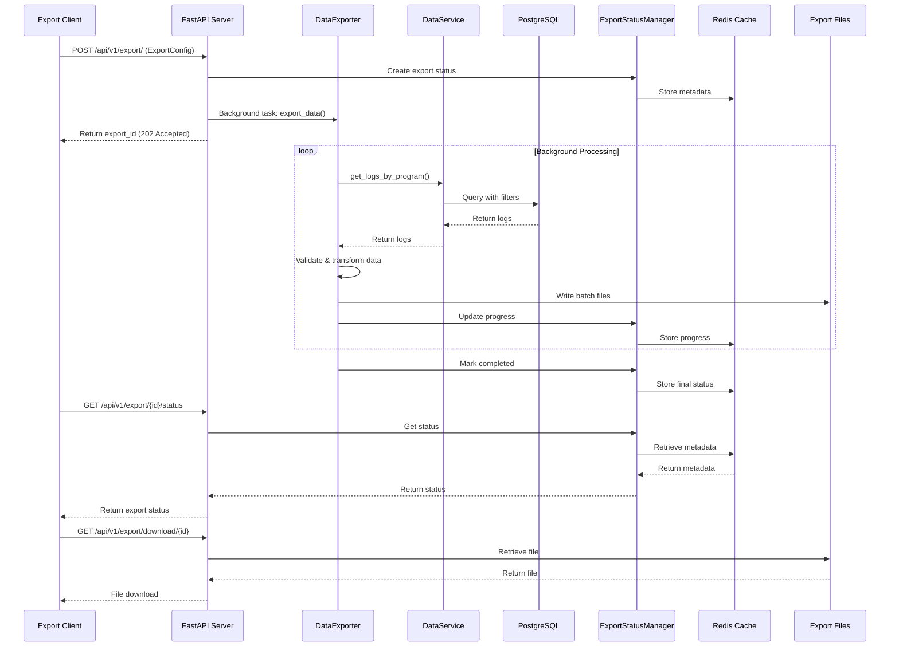

# Overall Architecture for Modular AI Processing Service

## 1. Introduction

This document provides a comprehensive architecture for the **Modular, Extensible AI Processing Service**, an independent system designed to analyze OpenWRT network logs for anomaly detection within the Log Monitor framework. The service operates remotely from the log collector, fetches logs from a PostgreSQL database (local or remote), stores anomalies in a local SQLite database, and performs lightweight inference on a resource-constrained device like the Raspberry Pi 5 (4-8GB RAM, quad-core CPU). It emphasizes modularity through a plug-in agent architecture, minimal dependency on the database schema, and decoupled model management with external training.

### Objectives
- **Modularity**: Enable plug-and-play addition of analysis agents (e.g., Wi-Fi, firewall, DNS) without modifying core components.
- **Efficiency**: Optimize resource usage for the Raspberry Pi 5 using direct method calls, connection pooling, and caching.
- **Decoupling**: Minimize PostgreSQL schema dependency and separate training from inference.
- **Local Storage**: Store anomalies in a local SQLite database for better performance and independence.
- **Remote Operation**: Support secure, reliable access to a remote database and external training environments.
- **Robustness**: Include health checks, graceful shutdowns, and error handling for production reliability.
- **Data Export**: Provide comprehensive data export capabilities for training and analysis purposes.

### Key Features
- Centralized `DataService` for database and cache access.
- Pluggable agent architecture based on `BaseAgent`.
- Local SQLite storage for anomalies (`/app/data/mcp_anomalies.db`).
- Disk-based model storage (`/app/models`) for external training.
- Secure PostgreSQL connectivity with Redis caching and retry logic.
- Lightweight health check endpoint for Docker monitoring.
- **Data Export System**: Complete export functionality with background processing, status tracking, and multiple output formats.

## 2. System Context

The AI Processing Service is a standalone, Dockerized application that interfaces with external systems, including a PostgreSQL database (read-only), notification services, a training environment, and export consumers. It operates independently of the Syslog Service, which collects logs.

### External Components
- **PostgreSQL Database**: Stores logs (`log_entries`), accessible locally (e.g., Raspberry Pi) or remotely (e.g., cloud-hosted).
- **SQLite Database**: Local storage for anomalies (`mcp_anomalies`), managed by the service.
- **Syslog Service**: External process populating `log_entries` via syslog-ng.
- **Notification Systems**: Email (SMTP) or Slack for anomaly alerts.
- **Training Environment**: High-performance machine for model training, exporting logs, and deploying models.
- **Export Consumers**: External systems that consume exported data for analysis, training, or compliance purposes.

### Training Service Independence

The training service functionality has been intentionally excluded from the MCP service frontend to maintain proper architectural boundaries:

- **Separation of Concerns**: The training service may be deployed on a separate server and should have its own independent UI
- **No Service Co-location Assumptions**: This design prevents unnecessary coupling and architectural assumptions about service deployment
- **Independent Development**: Each service can evolve independently without affecting the other
- **Scalability**: Services can be scaled independently based on their specific resource requirements

The MCP service frontend focuses on:
- Model management and deployment
- Performance monitoring
- Anomaly detection and analysis
- Data export functionality

The training service should provide its own UI for:
- Model training workflows
- Training data management
- Model validation and testing
- Training job monitoring

This architectural decision ensures that each service remains focused on its core responsibilities and can be deployed, scaled, and maintained independently.

### Diagram


## 3. Architecture

The service runs as a single process within a Docker container, comprising a centralized `DataService`, pluggable agents, shared components, a comprehensive export system, and a health check endpoint. Communication between components uses direct method calls, eliminating the need for inter-service messaging.

### Components
1. **DataService**:
   - Centralized Data Access Layer (DAL) managing:
     - PostgreSQL connection pool (read-only)
     - SQLite database for anomalies
     - Redis caching
   - Provides methods for:
     - Reading logs from PostgreSQL
     - Storing/retrieving anomalies in SQLite
     - Caching frequently accessed data
   - Location: `/mcp_service/data_service.py`

2. **BaseAgent (Abstract Class)**:
   - Defines standard interface for all agents
   - Ensures modularity and consistency
   - Location: `/mcp_service/agents/base_agent.py`

3. **WiFiAgent**:
   - Implements `BaseAgent` for Wi-Fi anomaly detection
   - Uses `DataService` for log retrieval and anomaly storage
   - Location: `/mcp_service/agents/wifi_agent.py`

4. **FeatureExtractor**:
   - Extracts features from logs
   - Shared between production and training
   - Location: `/mcp_service/components/feature_extractor.py`

5. **ModelManager**:
   - Loads models from disk
   - Supports hot-reload for zero-downtime updates
   - Location: `/mcp_service/components/model_manager.py`

6. **AnomalyClassifier**:
   - Classifies anomalies based on model predictions
   - Location: `/mcp_service/components/anomaly_classifier.py`

7. **ResourceMonitor**:
   - Prevents overload (CPU > 80%, memory > 70%)
   - Location: `/mcp_service/components/resource_monitor.py`

8. **Export System**:
   - **DataExporter**: Main export logic with batch processing and multiple output formats
   - **ExportStatusManager**: Real-time status tracking using Redis
   - **DataValidator**: Data quality validation and metrics
   - **DataTransformer**: Data standardization and transformation
   - **ExportCleanupService**: Automated cleanup of old export files
   - Location: `/app/services/export/`

9. **FastAPI Web Server**:
   - RESTful API endpoints for service management and data export
   - Background task processing for export operations
   - CORS support for frontend integration
   - Location: `/app/main.py`

10. **Health Endpoint**:
    - Lightweight health check on port 5555
    - Verifies service health and database connectivity
    - Location: `/mcp_service/mcp_service.py`

## 4. Data Flow

### Runtime Data Flow


### Export Data Flow


## 5. Database Schema

### PostgreSQL Schema (Read-Only)
- **log_entries**:
  ```sql
  CREATE TABLE log_entries (
      id INTEGER PRIMARY KEY,
      device_id INTEGER NOT NULL,
      device_ip VARCHAR(255),
      timestamp TIMESTAMP NOT NULL,
      log_level VARCHAR(50),
      process_name VARCHAR(255),
      message TEXT NOT NULL,
      raw_message TEXT NOT NULL,
      structured_data JSONB,
      pushed_to_ai BOOLEAN DEFAULT FALSE,
      pushed_at TIMESTAMP,
      push_attempts INTEGER DEFAULT 0,
      last_push_error TEXT
  );

  -- Indexes for efficient querying
  CREATE INDEX idx_log_entries_device_id ON log_entries(device_id);
  CREATE INDEX idx_log_entries_timestamp ON log_entries(timestamp);
  CREATE INDEX idx_log_entries_log_level ON log_entries(log_level);
  CREATE INDEX idx_log_entries_process_name ON log_entries(process_name);
  ```

### SQLite Schema (Local)
- **mcp_anomalies**:
  ```sql
  CREATE TABLE mcp_anomalies (
      id INTEGER PRIMARY KEY AUTOINCREMENT,
      agent_name TEXT NOT NULL,
      device_id INTEGER,
      timestamp TEXT NOT NULL,
      anomaly_type TEXT NOT NULL,
      severity INTEGER NOT NULL,
      confidence REAL NOT NULL,
      description TEXT,
      features TEXT,  -- JSON stored as TEXT
      status TEXT DEFAULT 'new',
      synced INTEGER DEFAULT 0,
      created_at TEXT DEFAULT CURRENT_TIMESTAMP,
      updated_at TEXT,
      resolution_status TEXT DEFAULT 'open',
      resolution_notes TEXT
  );
  ```

## 6. Status Variables

The service uses Redis to maintain status information for all components. Each service's status is tracked using a consistent key pattern with the `mcp:` prefix.

### Redis Status Keys
```redis
# Service Status Keys
mcp:database:status          # Database connection status
mcp:database:health          # Database health status
mcp:database:error           # Last database error
mcp:database:last_check      # Timestamp of last check

mcp:model_service:status     # Model service status
mcp:model_service:health     # Model service health
mcp:model_service:error      # Last model service error
mcp:model_service:last_check # Timestamp of last check

mcp:backend:status          # Backend service status
mcp:backend:health          # Backend service health
mcp:backend:error           # Last backend error
mcp:backend:last_check      # Timestamp of last check

mcp:mcp_service:status      # MCP service status
mcp:mcp_service:health      # MCP service health
mcp:mcp_service:error       # Last MCP service error
mcp:mcp_service:last_check  # Timestamp of last check

mcp:data_source:status      # Data source status
mcp:data_source:health      # Data source health
mcp:data_source:error       # Last data source error
mcp:data_source:last_check  # Timestamp of last check

mcp:node_exporter:status    # Node exporter status
mcp:node_exporter:health    # Node exporter health
mcp:node_exporter:error     # Last node exporter error
mcp:node_exporter:last_check # Timestamp of last check

# Export Status Keys
export:metadata:{export_id}  # Export metadata and status
```

### Status Values
- **status**: Can be one of:
  - `connected`: Service is connected and operational
  - `disconnected`: Service is not connected
  - `error`: Service encountered an error

- **health**: Boolean value indicating if the service is healthy
  - `true`: Service is healthy
  - `false`: Service is unhealthy

- **error**: String containing the last error message or `null` if no error

- **last_check**: ISO 8601 timestamp of the last status check

### Status Management
- Each service updates its own status in Redis
- Status checks occur every 10 seconds
- Health checks include:
  - Database connectivity
  - Redis connectivity
  - Service-specific health metrics
  - Resource usage (CPU, memory)

## 7. Configuration

### Environment Variables
```ini
# Database Configuration (PostgreSQL - Read Only)
DB_HOST=192.168.10.14
DB_PORT=5432
DB_NAME=netmonitor_db
DB_USER=netmonitor_user
DB_PASSWORD=netmonitor_password

# SQLite Configuration
SQLITE_DB_PATH=/app/data/mcp_anomalies.db
SQLITE_JOURNAL_MODE=WAL
SQLITE_SYNCHRONOUS=NORMAL
SQLITE_CACHE_SIZE=-2000
SQLITE_TEMP_STORE=MEMORY
SQLITE_MMAP_SIZE=30000000000

# Redis Configuration
REDIS_HOST=localhost
REDIS_PORT=6379
REDIS_DB=0

# Service Configuration
SERVICE_HOST=0.0.0.0
SERVICE_PORT=5555
LOG_LEVEL=INFO
ANALYSIS_INTERVAL=300

# Export Configuration
EXPORT_BATCH_SIZE=1000
EXPORT_MAX_FILE_SIZE=100MB
EXPORT_RETENTION_DAYS=7
EXPORT_CLEANUP_INTERVAL=3600
```

## 8. Deployment

### Docker Configuration
```yaml
version: '3.8'
services:
  mcp-service:
    build:
      context: .
      dockerfile: Dockerfile
    environment:
      - DB_HOST=${DB_HOST}
      - DB_PORT=${DB_PORT}
      - DB_NAME=${DB_NAME}
      - DB_USER=${DB_USER}
      - DB_PASSWORD=${DB_PASSWORD}
      - SQLITE_DB_PATH=/app/data/mcp_anomalies.db
      - REDIS_HOST=${REDIS_HOST}
      - REDIS_PORT=${REDIS_PORT}
    ports:
      - "5555:5555"
      - "5000:5000"  # FastAPI web server
    volumes:
      - models:/app/models
      - anomaly_data:/app/data
      - exports:/app/exports  # Export file storage
    healthcheck:
      test: ["CMD", "curl", "-f", "http://localhost:5555/health"]
      interval: 30s
      timeout: 10s
      retries: 3
  redis:
    image: redis:6.2
    ports:
      - "6379:6379"
volumes:
  models:
  anomaly_data:
  exports:
```

## 9. Resource Optimization

- **Direct Calls**: Eliminates MQTT overhead (~20MB memory)
- **Database**: 
  - PostgreSQL: Read-only, connection pooling
  - SQLite: WAL mode, memory-mapped I/O
- **Caching**: Redis reduces database load (TTL: 300s)
- **Model Storage**: Disk-based, no database overhead
- **Polling**: 5-minute intervals
- **ResourceMonitor**: Prevents overload
- **Export Processing**: Background tasks with batch processing to minimize memory usage

## 10. Security

- **Database**: 
  - PostgreSQL: SSL/TLS, read-only access
  - SQLite: File permissions, WAL mode
- **Model Files**: SFTP for secure transfers
- **Credentials**: Environment variables
- **Health Endpoint**: Read-only, no sensitive data
- **Export Files**: Secure file storage with access controls

## 11. Extensibility

- **New Agents**: Implement `BaseAgent`
- **New Features**: Extend `DataService` methods
- **Real-Time**: Add streaming via WebSockets
- **Backup**: Add periodic SQLite backups
- **Export Formats**: Extend DataExporter with new output formats
- **Export Filters**: Add custom filtering capabilities

## 12. Implementation Steps

1. **Configure PostgreSQL**:
   - Verify read-only access to `log_entries`
2. **Initialize SQLite**:
   - Create database and schema
   - Set up WAL mode
3. **Deploy Redis**:
   - Run Redis container
4. **Develop Service**:
   - Implement components
5. **Train Models**:
   - Run training scripts
   - Deploy models
6. **Deploy Service**:
   - Build and run Docker container
7. **Test**:
   - Verify log retrieval
   - Test anomaly detection
   - Check health endpoints
   - Validate export functionality

## 13. Testing
### Unit Tests
```python
# mcp_service/tests/test_data_service.py
import pytest
from ..data_service import DataService
from ..config import Config

@pytest.mark.asyncio
async def test_get_logs_by_program():
    config = Config()
    service = DataService(config)
    await service.start()
    logs = await service.get_logs_by_program(
        "2025-06-07T12:00:00",
        "2025-06-07T12:05:00",
        ['hostapd', 'wpa_supplicant']
    )
    assert all(log['program'] in ['hostapd', 'wpa_supplicant'] for log in logs)
    await service.stop()
```

### Integration Tests
```python
# mcp_service/tests/test_wifi_agent.py
import pytest
from ..agents.wifi_agent import WiFiAgent
from ..data_service import DataService
from ..config import Config

@pytest.mark.asyncio
async def test_wifi_agent_cycle():
    config = Config()
    service = DataService(config)
    await service.start()
    agent = WiFiAgent(config, service)
    await agent.start()
    await agent.run_analysis_cycle()
    # Verify anomalies in mcp_anomalies via DB query
    await agent.stop()
    await service.stop()
```

### Export Tests
```python
# tests/integration/test_export_api.py
import pytest
from fastapi.testclient import TestClient
from app.main import app

client = TestClient(app)

def test_create_export():
    """Test creating an export job."""
    response = client.post("/api/v1/export/", json={
        "data_types": ["logs"],
        "batch_size": 100,
        "include_metadata": True,
        "output_format": "json",
        "compression": False
    })
    assert response.status_code == 200
    data = response.json()
    assert "export_id" in data
    assert data["status"] == "pending"
```

## 14. Conclusion

The Modular AI Processing Service integrates a centralized `DataService`, pluggable agents (`WiFiAgent`), a comprehensive export system, and a decoupled training/deployment workflow to deliver efficient, extensible anomaly detection. By using direct method calls, disk-based model storage, minimal schema dependency, and background task processing, it meets the requirements for remote operation, resource efficiency on the Raspberry Pi 5, plug-and-play modularity, and comprehensive data export capabilities. The architecture supports future enhancements (e.g., new agents, real-time streaming, additional export formats) while maintaining compatibility with the Log Monitor framework.

## Overview

The MCP Service is designed as a modular system with clear separation of concerns between different components.

## Service Separation

### Training Service Independence

The training service functionality has been intentionally excluded from the MCP service frontend to maintain proper architectural boundaries:

- **Separation of Concerns**: The training service may be deployed on a separate server and should have its own independent UI
- **No Service Co-location Assumptions**: This design prevents unnecessary coupling and architectural assumptions about service deployment
- **Independent Development**: Each service can evolve independently without affecting the other
- **Scalability**: Services can be scaled independently based on their specific resource requirements

The MCP service frontend focuses on:
- Model management and deployment
- Performance monitoring
- Anomaly detection and analysis
- Data export functionality

The training service should provide its own UI for:
- Model training workflows
- Training data management
- Model validation and testing
- Training job monitoring

This architectural decision ensures that each service remains focused on its core responsibilities and can be deployed, scaled, and maintained independently.