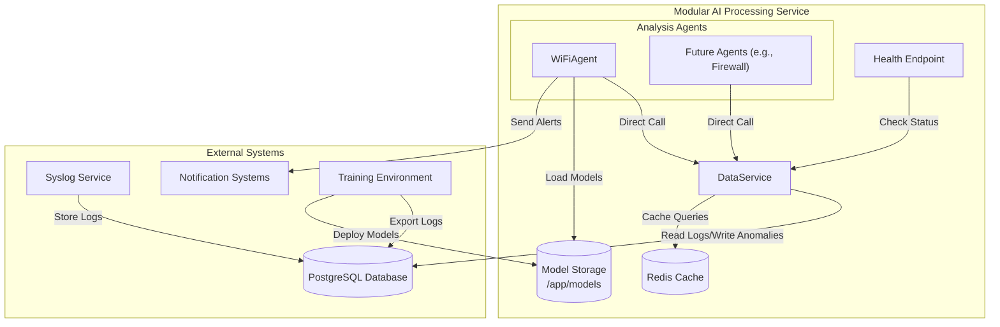
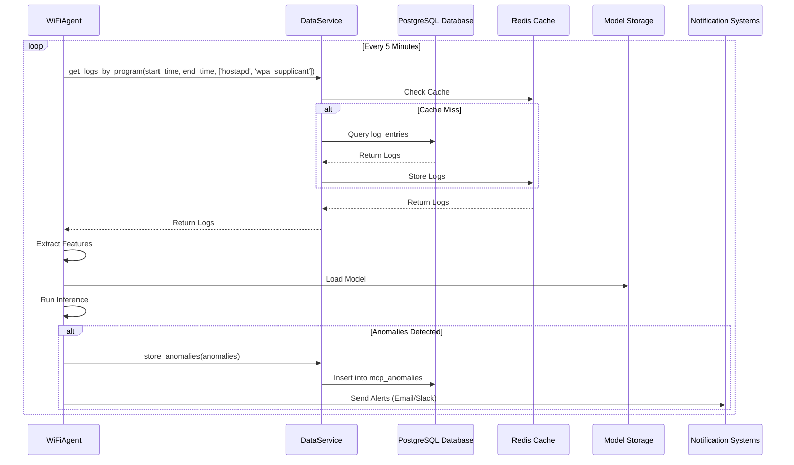
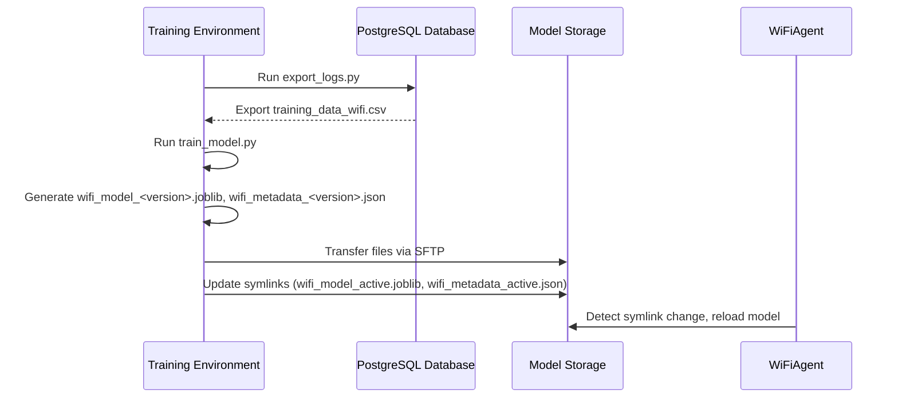

# Overall Architecture for Modular AI Processing Service

## 1. Introduction

This document provides a comprehensive architecture for the **Modular, Extensible AI Processing Service**, an independent system designed to analyze OpenWRT network logs for anomaly detection within the Log Monitor framework. The service operates remotely from the log collector, fetches logs from a PostgreSQL database (local or remote), and performs lightweight inference on a resource-constrained device like the Raspberry Pi 5 (4-8GB RAM, quad-core CPU). It emphasizes modularity through a plug-in agent architecture, minimal dependency on the database schema, and decoupled model management with external training. The architecture integrates the **DataService** (replacing `ExtendedMCPServer`), **analysis agents** (e.g., `WiFiAgent`), and a **model training/deployment workflow**, ensuring efficiency, extensibility, and compatibility with the framework (`AILogAnalyzer-Architecture.md`, `log_processing.md`, `architecture.md`).

### Objectives
- **Modularity**: Enable plug-and-play addition of analysis agents (e.g., Wi-Fi, firewall, DNS) without modifying core components.
- **Efficiency**: Optimize resource usage for the Raspberry Pi 5 using direct method calls, connection pooling, and caching.
- **Decoupling**: Minimize PostgreSQL schema dependency and separate training from inference.
- **Remote Operation**: Support secure, reliable access to a remote database and external training environments.
- **Robustness**: Include health checks, graceful shutdowns, and error handling for production reliability.

### Key Features
- Centralized `DataService` for database and cache access.
- Pluggable agent architecture based on `BaseAgent`.
- Disk-based model storage (`/app/models`) for external training.
- Service-specific `mcp_anomalies` table for anomaly storage.
- Secure PostgreSQL connectivity with Redis caching and retry logic.
- Lightweight health check endpoint for Docker monitoring.

## 2. System Context

The AI Processing Service is a standalone, Dockerized application that interfaces with external systems, including a PostgreSQL database, notification services, and a training environment. It operates independently of the Syslog Service, which collects logs.

### External Components
- **PostgreSQL Database**: Stores logs (`log_entries`) and anomalies (`mcp_anomalies`), accessible locally (e.g., Raspberry Pi) or remotely (e.g., cloud-hosted).
- **Syslog Service**: External process populating `log_entries` via syslog-ng (`log_processing.md`).
- **Notification Systems**: Email (SMTP) or Slack for anomaly alerts.
- **Training Environment**: High-performance machine (e.g., cloud VM, developer laptop) for model training, exporting logs, and deploying models.

### Diagram


## 3. Architecture

The service runs as a single process within a Docker container, comprising a centralized `DataService`, pluggable agents, shared components, and a health check endpoint. Communication between components uses direct method calls, eliminating the need for inter-service messaging (e.g., MQTT).

### Components
1. **DataService**:
   - Centralized Data Access Layer (DAL) managing PostgreSQL connection pooling (`asyncpg`) and Redis caching.
   - Provides generic methods (e.g., `get_logs_by_program`, `store_anomalies`) for agents.
   - Minimizes schema dependency by requiring only `timestamp`, `message`, `program` from `log_entries`.
   - Location: `/mcp_service/data_service.py`

2. **BaseAgent (Abstract Class)**:
   - Defines a standard interface (`start`, `run_analysis_cycle`, `stop`) for all agents.
   - Ensures modularity and consistency for new agents.
   - Location: `/mcp_service/agents/base_agent.py`

3. **WiFiAgent**:
   - Implements `BaseAgent` for Wi-Fi anomaly detection using Isolation Forest.
   - Calls `DataService` every 5 minutes to retrieve Wi-Fi logs (`hostapd`, `wpa_supplicant`).
   - Uses `FeatureExtractor`, `ModelManager`, and `AnomalyClassifier` for analysis.
   - Stores anomalies in `mcp_anomalies` and sends alerts.
   - Location: `/mcp_service/agents/wifi_agent.py`

4. **FeatureExtractor**:
   - Extracts features (e.g., `disassociation_events`, `error_log_ratio`) from logs.
   - Shared between production and training for consistency.
   - Location: `/mcp_service/components/feature_extractor.py`

5. **ModelManager**:
   - Loads Isolation Forest models from disk (`/app/models/wifi_model_active.joblib`).
   - Supports hot-reload for zero-downtime model updates via symlink changes.
   - Location: `/mcp_service/components/model_manager.py`

6. **AnomalyClassifier**:
   - Classifies anomalies based on model predictions, generating human-readable descriptions.
   - Location: `/mcp_service/components/anomaly_classifier.py`

7. **ResourceMonitor**:
   - Pauses analysis if CPU > 80% or memory > 70% to prevent overload.
   - Location: `/mcp_service/components/resource_monitor.py`

8. **Health Endpoint**:
   - Lightweight `aiohttp` server on port 5555 for Docker health checks (`/health`).
   - Verifies `DataService` connectivity to PostgreSQL and Redis.
   - Integrated into `mcp_service.py`

9. **Model Storage**:
   - Directory: `/app/models` (Docker volume)
   - Files: `wifi_model_<version>.joblib`, `wifi_metadata_<version>.json`, symlinks (`wifi_model_active.joblib`, `wifi_metadata_active.json`)

## 4. Data Flow

### Runtime Data Flow


### Training and Deployment Data Flow


## 5. Database Schema

### Minimal Schema Requirements
- **log_entries** (read-only):
  ```sql
  CREATE TABLE log_entries (
      timestamp TIMESTAMP NOT NULL,
      message TEXT NOT NULL,
      program VARCHAR(255),
      device_id INTEGER, -- Optional
      -- Other columns ignored
      created_at TIMESTAMP DEFAULT CURRENT_TIMESTAMP
  );
  CREATE INDEX idx_log_entries_timestamp ON log_entries(timestamp);
  CREATE INDEX idx_log_entries_program ON log_entries(program);
  ```
  - Required: `timestamp`, `message`, `program`
  - Optional: `device_id`
  - Configurable column mapping in `config.py`

### Service-Specific Table
- **mcp_anomalies**:
  ```sql
  CREATE TABLE mcp_anomalies (
      id SERIAL PRIMARY KEY,
      agent_name VARCHAR(50) NOT NULL,
      device_id INTEGER,
      timestamp TIMESTAMP NOT NULL,
      anomaly_type VARCHAR(50) NOT NULL,
      confidence FLOAT NOT NULL,
      description TEXT,
      features JSONB,
      created_at TIMESTAMP DEFAULT CURRENT_TIMESTAMP
  );
  ```
  - Stores anomalies (e.g., `agent_name='wifi'`, `anomaly_type='frequent_disconnections'`).

## 6. Model Training and Deployment

### Training Workflow
- **Environment**: External high-performance machine (e.g., cloud VM).
- **Scripts**:
  - `export_logs.py`: Exports logs from `log_entries` to `training_data_wifi.csv`.
  - `train_model.py`: Trains Isolation Forest model, generates `.joblib` and `.json` files.
- **Process**:
  1. Export logs for a time range (e.g., 30 days) using `export_logs.py`.
  2. Load logs into Pandas, extract features using `FeatureExtractor`.
  3. Train Isolation Forest model (`n_estimators=100`, `contamination=0.01`).
  4. Serialize model to `wifi_model_<version>.joblib` and metadata to `wifi_metadata_<version>.json`.
- **Metadata Example**:
  ```json
  {
      "model_version": "20250607_230000",
      "model_file": "wifi_model_20250607_230000.joblib",
      "agent_name": "wifi",
      "training_date": "2025-06-07T23:00:00Z",
      "training_data_source": "training_data_wifi.csv",
      "training_log_count": 1572030,
      "hyperparameters": {
          "n_estimators": 100,
          "contamination": 0.01,
          "max_samples": "auto",
          "random_state": 42
      },
      "features_used": [
          "log_count",
          "error_log_ratio",
          "unique_program_count",
          "disassociation_events"
      ]
  }
  ```

### Deployment Workflow
- **Transfer**: Copy `.joblib` and `.json` files to `/app/models` via SFTP.
- **Activation**: Update symlinks:
  ```bash
  ln -snf wifi_model_20250607_230000.joblib /app/models/wifi_model_active.joblib
  ln -snf wifi_metadata_20250607_230000.json /app/models/wifi_metadata_active.json
  ```
- **Model Loading**: `ModelManager` detects symlink changes and reloads the model without service restart.

## 7. Service Implementation

### Directory Structure
```
/mcp_service
├── mcp_service.py
├── data_service.py
├── config.py
├── export_logs.py
├── train_model.py
├── /agents
│   ├── base_agent.py
│   └── wifi_agent.py
├── /components
│   ├── feature_extractor.py
│   ├── model_manager.py
│   ├── anomaly_classifier.py
│   ├── resource_monitor.py
├── /tests
│   ├── test_data_service.py
│   ├── test_wifi_agent.py
├── Dockerfile
├── docker-compose.yml
├── requirements.txt
└── /models
    ├── wifi_model_<version>.joblib
    ├── wifi_metadata_<version>.json
    ├── wifi_model_active.joblib
    ├── wifi_metadata_active.json
```

### Main Entrypoint
```python
# mcp_service.py
import asyncio
from aiohttp import web
from data_service import DataService
from agents.wifi_agent import WiFiAgent
from config import Config

async def health_check_handler(request):
    data_service = request.app['data_service']
    status = await data_service.health()
    return web.json_response(status, status=200 if status['status'] == 'healthy' else 503)

async def main():
    config = Config()
    data_service = DataService(config)
    await data_service.start()

    agents = [WiFiAgent(config, data_service)]
    for agent in agents:
        await agent.start()

    async def run_agents_loop():
        while True:
            await asyncio.gather(*[agent.run_analysis_cycle() for agent in agents])
            await asyncio.sleep(300)

    app = web.Application()
    app['data_service'] = data_service
    app.router.add_get("/health", health_check_handler)
    runner = web.AppRunner(app)
    await runner.setup()
    site = web.TCPSite(runner, '0.0.0.0', 5555)
    await site.start()

    await run_agents_loop()

if __name__ == "__main__":
    asyncio.run(main())
```

### DataService
```python
# mcp_service/data_service.py
import asyncpg
import redis.asyncio as redis
import logging
import json
from tenacity import retry, wait_fixed, stop_after_attempt

class DataService:
    def __init__(self, config):
        self.db_config = config.db_config
        self.redis_config = config.redis_config
        self.log_columns = config.log_columns
        self.pool = None
        self.redis = None
        self.logger = logging.getLogger("DataService")

    async def start(self):
        self.pool = await asyncpg.create_pool(**self.db_config)
        self.redis = redis.Redis(**self.redis_config)
        self.logger.info("Initialized database and Redis")

    async def stop(self):
        if self.pool:
            await self.pool.close()
        if self.redis:
            await self.redis.close()
        self.logger.info("Closed database and Redis")

    @retry(stop=stop_after_attempt(3), wait=wait_fixed(5))
    async def get_logs_by_program(self, start_time, end_time, programs, device_id=None):
        cache_key = f"get_logs_by_program:{start_time}:{end_time}:{programs}:{device_id}"
        cached = await self.redis.get(cache_key)
        if cached:
            self.logger.info(f"Cache hit for {cache_key}")
            return json.loads(cached)

        async with self.pool.acquire() as conn:
            columns = ', '.join(self.log_columns.values())
            query = f"""
                SELECT {columns}
                FROM log_entries
                WHERE timestamp >= $1 AND timestamp <= $2
                AND program = ANY($3::text[])
            """
            params = [start_time, end_time, programs]
            if device_id and 'device_id' in self.log_columns:
                query += " AND device_id = $4"
                params.append(device_id)
            logs = await conn.fetch(query, *params)
            logs = [dict(record) for record in logs]
            await self.redis.setex(cache_key, 300, json.dumps(logs))
            self.logger.info(f"Retrieved {len(logs)} logs")
            return logs

    async def store_anomalies(self, anomalies):
        async with self.pool.acquire() as conn:
            for anomaly in anomalies:
                await conn.execute(
                    """
                    INSERT INTO mcp_anomalies (agent_name, device_id, timestamp, anomaly_type, confidence, description, features)
                    VALUES ($1, $2, $3, $4, $5, $6, $7)
                    """,
                    anomaly.get("agent_name"),
                    anomaly.get("device_id"),
                    anomaly.get("timestamp"),
                    anomaly.get("anomaly_type"),
                    anomaly.get("confidence"),
                    anomaly.get("description"),
                    anomaly.get("features", {})
                )

    async def health(self):
        try:
            async with self.pool.acquire() as conn:
                await conn.execute("SELECT 1")
            await self.redis.ping()
            return {"status": "healthy"}
        except Exception as e:
            self.logger.error(f"Health check failed: {str(e)}")
            return {"status": "unhealthy", "error": str(e)}
```

### WiFiAgent
```python
# mcp_service/agents/wifi_agent.py
from .base_agent import BaseAgent
from ..components.feature_extractor import WiFiFeatureExtractor
from ..components.model_manager import WiFiModelManager
from ..components.anomaly_classifier import WiFiAnomalyClassifier
from ..components.resource_monitor import ResourceMonitor
import asyncio
import logging
from datetime import datetime, timedelta
import asyncpg
import aiohttp

class WiFiAgent(BaseAgent):
    def __init__(self, config, data_service):
        super().__init__(config, data_service)
        self.agent_name = "wifi"
        self.wifi_programs = ['hostapd', 'wpa_supplicant']
        self.feature_extractor = WiFiFeatureExtractor()
        self.model_manager = WiFiModelManager(config)
        self.anomaly_classifier = WiFiAnomalyClassifier()
        self.resource_monitor = ResourceMonitor()
        self.notify_config = config.notify_config
        self.logger = logging.getLogger("WiFiAgent")
        self.pool = None

    async def start(self):
        self.pool = await asyncpg.create_pool(**self.data_service.db_config)
        await self.model_manager.start()
        self.logger.info("WiFiAgent started")

    async def stop(self):
        await self.model_manager.stop()
        if self.pool:
            await self.pool.close()
        self.logger.info("WiFiAgent stopped")

    async def run_analysis_cycle(self):
        if not self.resource_monitor.is_safe():
            self.logger.warning("Resource limit exceeded, pausing analysis")
            return

        current_time = datetime.now()
        start_time = current_time - timedelta(minutes=5)
        logs = await self.data_service.get_logs_by_program(
            start_time.isoformat(),
            current_time.isoformat(),
            self.wifi_programs
        )
        self.logger.info(f"Retrieved {len(logs)} Wi-Fi logs")
        if not logs:
            return

        features = self.feature_extractor.extract_features(logs)
        results = self.model_manager.infer(features)
        anomalies = self.anomaly_classifier.classify(results)
        if anomalies:
            for anomaly in anomalies:
                anomaly['agent_name'] = self.agent_name
                anomaly['timestamp'] = datetime.now().isoformat()
            await self.data_service.store_anomalies(anomalies)
            await self._send_alerts(anomalies)
            self.logger.info(f"Detected {len(anomalies)} anomalies")

    async def _send_alerts(self, anomalies):
        async with aiohttp.ClientSession() as session:
            for anomaly in anomalies:
                if self.notify_config["email"]["enabled"]:
                    self.logger.info(f"Sending email: {anomaly['description']}")
                if self.notify_config["slack"]["enabled"]:
                    await session.post(
                        self.notify_config["slack"]["webhook_url"],
                        json={"text": anomaly["description"]}
                    )
                    self.logger.info(f"Sending Slack: {anomaly['description']}")
```

### Export Logs Script
```python
# mcp_service/export_logs.py
import asyncio
import asyncpg
import csv
import argparse
from datetime import datetime
from config import Config

async def export_logs(config, start_date, end_date, output_file, programs):
    pool = await asyncpg.create_pool(**config.db_config)
    async with pool.acquire() as conn:
        query = """
            SELECT timestamp, message, program, device_id
            FROM log_entries
            WHERE timestamp >= $1 AND timestamp <= $2
            AND program = ANY($3::text[])
        """
        logs = await conn.fetch(query, start_date, end_date, programs)
        with open(output_file, 'w', newline='') as f:
            writer = csv.DictWriter(f, fieldnames=['timestamp', 'message', 'program', 'device_id'])
            writer.writeheader()
            for log in logs:
                writer.writerow(dict(log))
    await pool.close()

if __name__ == "__main__":
    parser = argparse.ArgumentParser(description="Export logs for training")
    parser.add_argument("--start-date", required=True)
    parser.add_argument("--end-date", required=True)
    parser.add_argument("--output-file", required=True)
    parser.add_argument("--programs", required=True)
    args = parser.parse_args()
    config = Config()
    asyncio.run(export_logs(
        config,
        datetime.fromisoformat(args.start_date),
        datetime.fromisoformat(args.end_date),
        args.output_file,
        args.programs.split(',')
    ))
```

### Train Model Script
```python
# mcp_service/train_model.py
import pandas as pd
import joblib
import json
from sklearn.ensemble import IsolationForest
from components.feature_extractor import WiFiFeatureExtractor
from datetime import datetime
import argparse

def train_model(input_file, output_dir):
    df = pd.read_csv(input_file)
    extractor = WiFiFeatureExtractor()
    features = extractor.extract_features(df.to_dict('records'))
    
    model = IsolationForest(
        n_estimators=100,
        contamination=0.01,
        max_samples='auto',
        random_state=42
    )
    model.fit(features)
    
    version = datetime.now().strftime('%Y%m%d_%H%M%S')
    model_path = f"{output_dir}/wifi_model_{version}.joblib"
    metadata_path = f"{output_dir}/wifi_metadata_{version}.json"
    
    joblib.dump(model, model_path)
    metadata = {
        "model_version": version,
        "model_file": f"wifi_model_{version}.joblib",
        "agent_name": "wifi",
        "training_date": datetime.now().isoformat(),
        "training_data_source": input_file,
        "training_log_count": len(df),
        "hyperparameters": {
            "n_estimators": 100,
            "contamination": 0.01,
            "max_samples": "auto",
            "random_state": 42
        },
        "features_used": features.columns.tolist()
    }
    with open(metadata_path, 'w') as f:
        json.dump(metadata, f)
    
    print(f"Trained model saved to {model_path}, metadata to {metadata_path}")

if __name__ == "__main__":
    parser = argparse.ArgumentParser(description="Train Wi-Fi anomaly detection model")
    parser.add_argument("--input-file", required=True)
    parser.add_argument("--output-dir", default="/app/models")
    args = parser.parse_args()
    train_model(args.input_file, args.output_dir)
```

## 8. Configuration
### Environment Variables
```plaintext
DB_HOST=localhost
DB_PORT=5432
DB_NAME=logmonitor
DB_USER=postgres
DB_PASSWORD=secret
DB_SSLMODE=require
REDIS_HOST=localhost
REDIS_PORT=6379
EMAIL_ENABLED=true
SMTP_SERVER=smtp.example.com
SMTP_PORT=587
SMTP_USERNAME=user
SMTP_PASSWORD=pass
SLACK_ENABLED=false
SLACK_WEBHOOK_URL=https://hooks.slack.com/services/xxx
```

### Config File
```python
# mcp_service/config.py
import os

class Config:
    def __init__(self):
        self.db_config = {
            'host': os.getenv('DB_HOST', 'localhost'),
            'port': int(os.getenv('DB_PORT', 5432)),
            'database': os.getenv('DB_NAME', 'logmonitor'),
            'user': os.getenv('DB_USER', 'postgres'),
            'password': os.getenv('DB_PASSWORD', 'secret'),
            'sslmode': os.getenv('DB_SSLMODE', 'require')
        }
        self.redis_config = {
            'host': os.getenv('REDIS_HOST', 'localhost'),
            'port': int(os.getenv('REDIS_PORT', 6379))
        }
        self.notify_config = {
            'email': {
                'enabled': os.getenv('EMAIL_ENABLED', 'true').lower() == 'true',
                'smtp_server': os.getenv('SMTP_SERVER'),
                'smtp_port': int(os.getenv('SMTP_PORT', 587)),
                'username': os.getenv('SMTP_USERNAME'),
                'password': os.getenv('SMTP_PASSWORD')
            },
            'slack': {
                'enabled': os.getenv('SLACK_ENABLED', 'false').lower() == 'true',
                'webhook_url': os.getenv('SLACK_WEBHOOK_URL')
            }
        }
        self.log_columns = {
            'timestamp': os.getenv('DB_LOG_TIMESTAMP', 'timestamp'),
            'message': os.getenv('DB_LOG_MESSAGE', 'message'),
            'program': os.getenv('DB_LOG_PROGRAM', 'program'),
            'device_id': os.getenv('DB_LOG_DEVICE_ID', 'device_id')
        }
```

## 9. Deployment
### Docker Configuration
- **Dockerfile**:
  ```dockerfile
  FROM python:3.8-slim
  WORKDIR /app
  COPY requirements.txt .
  RUN pip install --no-cache-dir -r requirements.txt
  COPY . .
  ENV PYTHONUNBUFFERED=1
  CMD ["python", "mcp_service.py"]
  ```

- **requirements.txt**:
  ```plaintext
  asyncpg==0.27.0
  redis==4.5.4
  scikit-learn==1.0.2
  pandas==1.3.5
  joblib==1.1.0
  psutil==5.9.0
  aiohttp==3.8.1
  tenacity==8.0.1
  ```

- **docker-compose.yml**:
  ```yaml
  version: '3.8'
  services:
    mcp-service:
      build:
        context: .
        dockerfile: Dockerfile
      environment:
        - DB_HOST=${DB_HOST}
        - DB_PORT=${DB_PORT}
        - DB_NAME=${DB_NAME}
        - DB_USER=${DB_USER}
        - DB_PASSWORD=${DB_PASSWORD}
        - DB_SSLMODE=${DB_SSLMODE}
        - REDIS_HOST=${REDIS_HOST}
        - REDIS_PORT=${REDIS_PORT}
        - EMAIL_ENABLED=${EMAIL_ENABLED}
        - SMTP_SERVER=${SMTP_SERVER}
        - SMTP_PORT=${SMTP_PORT}
        - SMTP_USERNAME=${SMTP_USERNAME}
        - SMTP_PASSWORD=${SMTP_PASSWORD}
        - SLACK_ENABLED=${SLACK_ENABLED}
        - SLACK_WEBHOOK_URL=${SLACK_WEBHOOK_URL}
      ports:
        - "5555:5555"
      volumes:
        - models:/app/models
      healthcheck:
        test: ["CMD", "curl", "-f", "http://localhost:5555/health"]
        interval: 30s
        timeout: 10s
        retries: 3
    redis:
      image: redis:6.2
      ports:
        - "6379:6379"
  volumes:
    models:
  ```

## 10. Resource Optimization
- **Direct Calls**: Eliminates MQTT overhead (~20MB memory).
- **Database**: Minimal writes to `mcp_anomalies`, connection pooling.
- **Caching**: Redis reduces database load (TTL: 300s).
- **Model Storage**: Disk-based, no database overhead.
- **Polling**: 5-minute intervals.
- **ResourceMonitor**: Prevents overload (CPU > 80%, memory > 70%).

## 11. Security
- **Database**: SSL/TLS (`sslmode=require`).
- **Model Files**: SFTP for secure transfers.
- **Credentials**: Environment variables.
- **Health Endpoint**: Read-only, no sensitive data exposure.

## 12. Extensibility
- **New Agents**: Implement `BaseAgent` (e.g., `FirewallAgent`) and add to `mcp_service.py`.
- **New Features**: Extend `DataService` methods (e.g., `get_logs_by_type`).
- **Real-Time**: Add streaming via WebSockets if needed.

## 13. Implementation Steps
1. **Configure PostgreSQL**:
   - Create `log_entries` with minimal columns.
   - Create `mcp_anomalies`.
2. **Deploy Redis**:
   - Run Redis container.
3. **Develop Service**:
   - Implement components as per code snippets.
4. **Train Models**:
   - Run `export_logs.py` and `train_model.py` in training environment.
   - Deploy models to `/app/models`.
5. **Deploy Service**:
   - Build Docker: `docker build -t mcp-service .`
   - Run: `docker-compose up -d`
6. **Test**:
   - Verify log retrieval, anomaly detection, and health checks.

## 14. Testing
### Unit Tests
```python
# mcp_service/tests/test_data_service.py
import pytest
from ..data_service import DataService
from ..config import Config

@pytest.mark.asyncio
async def test_get_logs_by_program():
    config = Config()
    service = DataService(config)
    await service.start()
    logs = await service.get_logs_by_program(
        "2025-06-07T12:00:00",
        "2025-06-07T12:05:00",
        ['hostapd', 'wpa_supplicant']
    )
    assert all(log['program'] in ['hostapd', 'wpa_supplicant'] for log in logs)
    await service.stop()
```

### Integration Tests
```python
# mcp_service/tests/test_wifi_agent.py
import pytest
from ..agents.wifi_agent import WiFiAgent
from ..data_service import DataService
from ..config import Config

@pytest.mark.asyncio
async def test_wifi_agent_cycle():
    config = Config()
    service = DataService(config)
    await service.start()
    agent = WiFiAgent(config, service)
    await agent.start()
    await agent.run_analysis_cycle()
    # Verify anomalies in mcp_anomalies via DB query
    await agent.stop()
    await service.stop()
```

## 15. Conclusion

The Modular AI Processing Service integrates a centralized `DataService`, pluggable agents (`WiFiAgent`), and a decoupled training/deployment workflow to deliver efficient, extensible anomaly detection. By using direct method calls, disk-based model storage, and minimal schema dependency, it meets the requirements for remote operation, resource efficiency on the Raspberry Pi 5, and plug-and-play modularity. The architecture supports future enhancements (e.g., new agents, real-time streaming) while maintaining compatibility with the Log Monitor framework.