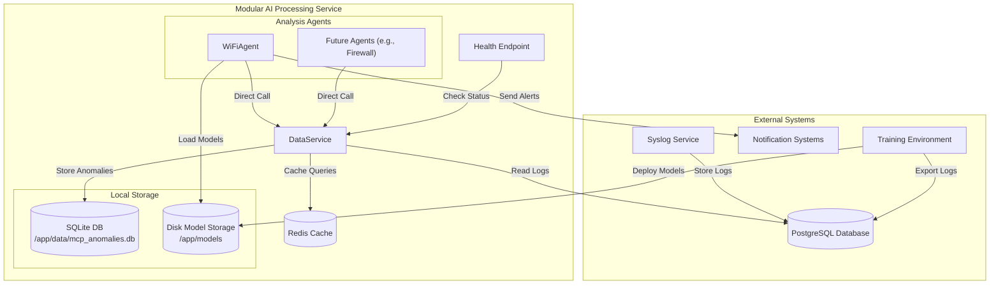

# Overall Architecture for Modular AI Processing Service

## 1. Introduction

This document provides a comprehensive architecture for the **Modular, Extensible AI Processing Service**, an independent system designed to analyze OpenWRT network logs for anomaly detection within the Log Monitor framework. The service operates remotely from the log collector, fetches logs from a PostgreSQL database (local or remote), stores anomalies in a local SQLite database, and performs lightweight inference on a resource-constrained device like the Raspberry Pi 5 (4-8GB RAM, quad-core CPU). It emphasizes modularity through a plug-in agent architecture, minimal dependency on the database schema, and decoupled model management with external training.

### Objectives
- **Modularity**: Enable plug-and-play addition of analysis agents (e.g., Wi-Fi, firewall, DNS) without modifying core components.
- **Efficiency**: Optimize resource usage for the Raspberry Pi 5 using direct method calls, connection pooling, and caching.
- **Decoupling**: Minimize PostgreSQL schema dependency and separate training from inference.
- **Local Storage**: Store anomalies in a local SQLite database for better performance and independence.
- **Remote Operation**: Support secure, reliable access to a remote database and external training environments.
- **Robustness**: Include health checks, graceful shutdowns, and error handling for production reliability.

### Key Features
- Centralized `DataService` for database and cache access.
- Pluggable agent architecture based on `BaseAgent`.
- Local SQLite storage for anomalies (`/app/data/mcp_anomalies.db`).
- Disk-based model storage (`/app/models`) for external training.
- Secure PostgreSQL connectivity with Redis caching and retry logic.
- Lightweight health check endpoint for Docker monitoring.

## 2. System Context

The AI Processing Service is a standalone, Dockerized application that interfaces with external systems, including a PostgreSQL database (read-only), notification services, and a training environment. It operates independently of the Syslog Service, which collects logs.

### External Components
- **PostgreSQL Database**: Stores logs (`log_entries`), accessible locally (e.g., Raspberry Pi) or remotely (e.g., cloud-hosted).
- **SQLite Database**: Local storage for anomalies (`mcp_anomalies`), managed by the service.
- **Syslog Service**: External process populating `log_entries` via syslog-ng.
- **Notification Systems**: Email (SMTP) or Slack for anomaly alerts.
- **Training Environment**: High-performance machine for model training, exporting logs, and deploying models.

### Diagram


## 3. Architecture

The service runs as a single process within a Docker container, comprising a centralized `DataService`, pluggable agents, shared components, and a health check endpoint. Communication between components uses direct method calls, eliminating the need for inter-service messaging.

### Components
1. **DataService**:
   - Centralized Data Access Layer (DAL) managing:
     - PostgreSQL connection pool (read-only)
     - SQLite database for anomalies
     - Redis caching
   - Provides methods for:
     - Reading logs from PostgreSQL
     - Storing/retrieving anomalies in SQLite
     - Caching frequently accessed data
   - Location: `/mcp_service/data_service.py`

2. **BaseAgent (Abstract Class)**:
   - Defines standard interface for all agents
   - Ensures modularity and consistency
   - Location: `/mcp_service/agents/base_agent.py`

3. **WiFiAgent**:
   - Implements `BaseAgent` for Wi-Fi anomaly detection
   - Uses `DataService` for log retrieval and anomaly storage
   - Location: `/mcp_service/agents/wifi_agent.py`

4. **FeatureExtractor**:
   - Extracts features from logs
   - Shared between production and training
   - Location: `/mcp_service/components/feature_extractor.py`

5. **ModelManager**:
   - Loads models from disk
   - Supports hot-reload for zero-downtime updates
   - Location: `/mcp_service/components/model_manager.py`

6. **AnomalyClassifier**:
   - Classifies anomalies based on model predictions
   - Location: `/mcp_service/components/anomaly_classifier.py`

7. **ResourceMonitor**:
   - Prevents overload (CPU > 80%, memory > 70%)
   - Location: `/mcp_service/components/resource_monitor.py`

8. **Health Endpoint**:
   - Lightweight `aiohttp` server on port 5555
   - Verifies service health and database connectivity
   - Location: `/mcp_service/mcp_service.py`

## 4. Data Flow

### Runtime Data Flow


## 5. Database Schema

### PostgreSQL Schema (Read-Only)
- **log_entries**:
  ```sql
  CREATE TABLE log_entries (
      id INTEGER PRIMARY KEY,
      device_id INTEGER NOT NULL,
      device_ip VARCHAR(255),
      timestamp TIMESTAMP NOT NULL,
      log_level VARCHAR(50),
      process_name VARCHAR(255),
      message TEXT NOT NULL,
      raw_message TEXT NOT NULL,
      structured_data JSONB,
      pushed_to_ai BOOLEAN DEFAULT FALSE,
      pushed_at TIMESTAMP,
      push_attempts INTEGER DEFAULT 0,
      last_push_error TEXT
  );

  -- Indexes for efficient querying
  CREATE INDEX idx_log_entries_device_id ON log_entries(device_id);
  CREATE INDEX idx_log_entries_timestamp ON log_entries(timestamp);
  CREATE INDEX idx_log_entries_log_level ON log_entries(log_level);
  CREATE INDEX idx_log_entries_process_name ON log_entries(process_name);
  ```

### SQLite Schema (Local)
- **mcp_anomalies**:
  ```sql
  CREATE TABLE mcp_anomalies (
      id INTEGER PRIMARY KEY AUTOINCREMENT,
      agent_name TEXT NOT NULL,
      device_id INTEGER,
      timestamp TEXT NOT NULL,
      anomaly_type TEXT NOT NULL,
      severity INTEGER NOT NULL,
      confidence REAL NOT NULL,
      description TEXT,
      features TEXT,  -- JSON stored as TEXT
      status TEXT DEFAULT 'new',
      synced INTEGER DEFAULT 0,
      created_at TEXT DEFAULT CURRENT_TIMESTAMP,
      updated_at TEXT,
      resolution_status TEXT DEFAULT 'open',
      resolution_notes TEXT
  );
  ```

## 6. Configuration

### Environment Variables
```ini
# Database Configuration (PostgreSQL - Read Only)
DB_HOST=192.168.10.14
DB_PORT=5432
DB_NAME=netmonitor_db
DB_USER=netmonitor_user
DB_PASSWORD=netmonitor_password

# SQLite Configuration
SQLITE_DB_PATH=/app/data/mcp_anomalies.db
SQLITE_JOURNAL_MODE=WAL
SQLITE_SYNCHRONOUS=NORMAL
SQLITE_CACHE_SIZE=-2000
SQLITE_TEMP_STORE=MEMORY
SQLITE_MMAP_SIZE=30000000000

# Redis Configuration
REDIS_HOST=localhost
REDIS_PORT=6379
REDIS_DB=0

# Service Configuration
SERVICE_HOST=0.0.0.0
SERVICE_PORT=5555
LOG_LEVEL=INFO
ANALYSIS_INTERVAL=300
```

## 7. Deployment

### Docker Configuration
```yaml
version: '3.8'
services:
  mcp-service:
    build:
      context: .
      dockerfile: Dockerfile
    environment:
      - DB_HOST=${DB_HOST}
      - DB_PORT=${DB_PORT}
      - DB_NAME=${DB_NAME}
      - DB_USER=${DB_USER}
      - DB_PASSWORD=${DB_PASSWORD}
      - SQLITE_DB_PATH=/app/data/mcp_anomalies.db
      - REDIS_HOST=${REDIS_HOST}
      - REDIS_PORT=${REDIS_PORT}
    ports:
      - "5555:5555"
    volumes:
      - models:/app/models
      - anomaly_data:/app/data
    healthcheck:
      test: ["CMD", "curl", "-f", "http://localhost:5555/health"]
      interval: 30s
      timeout: 10s
      retries: 3
  redis:
    image: redis:6.2
    ports:
      - "6379:6379"
volumes:
  models:
  anomaly_data:
```

## 8. Resource Optimization

- **Direct Calls**: Eliminates MQTT overhead (~20MB memory)
- **Database**: 
  - PostgreSQL: Read-only, connection pooling
  - SQLite: WAL mode, memory-mapped I/O
- **Caching**: Redis reduces database load (TTL: 300s)
- **Model Storage**: Disk-based, no database overhead
- **Polling**: 5-minute intervals
- **ResourceMonitor**: Prevents overload

## 9. Security

- **Database**: 
  - PostgreSQL: SSL/TLS, read-only access
  - SQLite: File permissions, WAL mode
- **Model Files**: SFTP for secure transfers
- **Credentials**: Environment variables
- **Health Endpoint**: Read-only, no sensitive data

## 10. Extensibility

- **New Agents**: Implement `BaseAgent`
- **New Features**: Extend `DataService` methods
- **Real-Time**: Add streaming via WebSockets
- **Backup**: Add periodic SQLite backups

## 11. Implementation Steps

1. **Configure PostgreSQL**:
   - Verify read-only access to `log_entries`
2. **Initialize SQLite**:
   - Create database and schema
   - Set up WAL mode
3. **Deploy Redis**:
   - Run Redis container
4. **Develop Service**:
   - Implement components
5. **Train Models**:
   - Run training scripts
   - Deploy models
6. **Deploy Service**:
   - Build and run Docker container
7. **Test**:
   - Verify log retrieval
   - Test anomaly detection
   - Check health endpoints

## 12. Testing
### Unit Tests
```python
# mcp_service/tests/test_data_service.py
import pytest
from ..data_service import DataService
from ..config import Config

@pytest.mark.asyncio
async def test_get_logs_by_program():
    config = Config()
    service = DataService(config)
    await service.start()
    logs = await service.get_logs_by_program(
        "2025-06-07T12:00:00",
        "2025-06-07T12:05:00",
        ['hostapd', 'wpa_supplicant']
    )
    assert all(log['program'] in ['hostapd', 'wpa_supplicant'] for log in logs)
    await service.stop()
```

### Integration Tests
```python
# mcp_service/tests/test_wifi_agent.py
import pytest
from ..agents.wifi_agent import WiFiAgent
from ..data_service import DataService
from ..config import Config

@pytest.mark.asyncio
async def test_wifi_agent_cycle():
    config = Config()
    service = DataService(config)
    await service.start()
    agent = WiFiAgent(config, service)
    await agent.start()
    await agent.run_analysis_cycle()
    # Verify anomalies in mcp_anomalies via DB query
    await agent.stop()
    await service.stop()
```

## 13. Conclusion

The Modular AI Processing Service integrates a centralized `DataService`, pluggable agents (`WiFiAgent`), and a decoupled training/deployment workflow to deliver efficient, extensible anomaly detection. By using direct method calls, disk-based model storage, and minimal schema dependency, it meets the requirements for remote operation, resource efficiency on the Raspberry Pi 5, and plug-and-play modularity. The architecture supports future enhancements (e.g., new agents, real-time streaming) while maintaining compatibility with the Log Monitor framework.